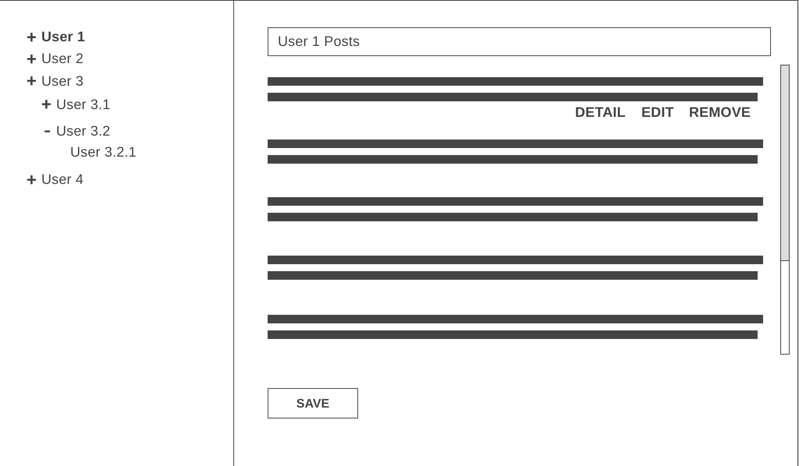
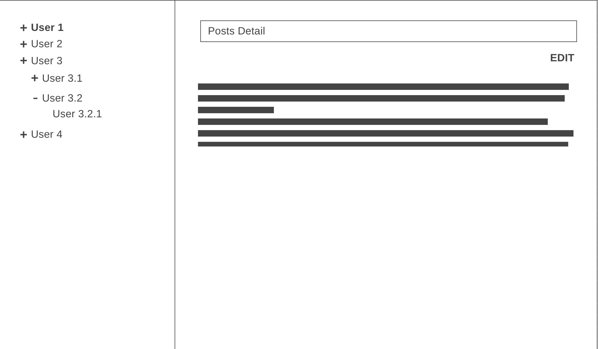
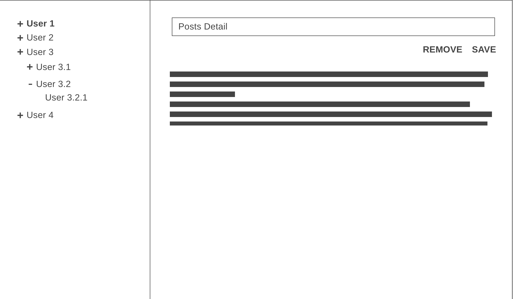
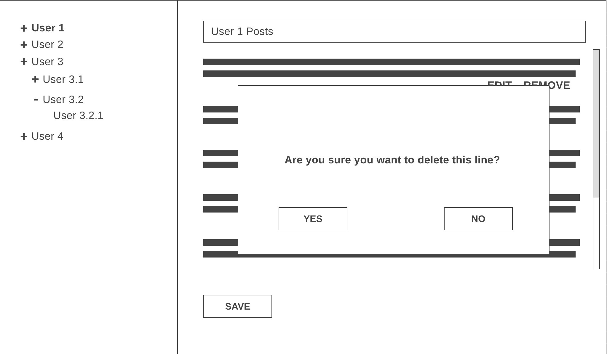

# Frontend Project 

## Requirements
* One of the modern front end libraries (Angular (Latest Version) is a big plus)
* State Management Library (NGXS is a big plus for Angular)
* RXJS (this is must for Angular)
* Unit Test With Jest

## General Descriptions

* A responsive design should be created.
* You can design the ui as you wish. 
* The users in users.json in the root directory should be shown hierarchically on the left side of the screen.
* When api requests are called, a loading gif should be shown on center of the screen. (http interceptor should be used for that for Angular).
* Writing reusable, clean and maintainable code is very important.

## Screens

### Post List


* For each user selected from the hierarchy, the posts of the user should be taken through the user list API and kept on the state and listed on the screen.
* If there is a post list on state for the relevant user, api request should not be called again, the list should be filled from the state.
* When mouse hovering over the lines, detail, edit and delete buttons should be displayed under the relevant line.
* When clicking Detail button post detail screen should be opened with choosen post id.
* When clicking Remove button related line should be removed without any api call. (it should be removed in the state).
* Must have ability to edit multiple lines.  
* When the save button is clicked, the api requests for each line must be called at the same time (parallel).
* A search input should be placed to the screen and the search should be triggered on the client side when the number of letters exceeds three character.
* A select box should be placed on this screen for sorting. (id, title and body)
* If there is any line in edit mode, search and sort inputs should be disabled.
* Inputs must be mandatory in the edit mode.

### Post Detail


* When opening this screen, the post detail api should be called and the information on the screen should be shown with the values returned from this api.
* When the page is refreshed, the post detail api should be called again.

### Post Edit


* With the edit button on the post detail page, you should switch to view mode.
* An alert should be issued when trying to refresh the page after making a change in the edit mode.
* If the page is refreshed without making changes, it must be opened in view mode.
* Remove action should delete the relevant post from the state.
* Edit inputs must be mandatory.

### Post Remove Confirmation


* When trying to delete the post, confirmation modal should be shown on the screen.
* This modal should be displayed on all screens where the remove action is called.

## API List

### Post List

<strong>Url: </strong> https://jsonplaceholder.typicode.com/posts

<strong>Url Parameter: </strong> userId

<strong>Method: </strong> GET

<strong>Response: </strong> 
```
[
  {
    userId: number,
    id: number,
    title: string,
    body: string
  }
]
```

### Post Detail

<strong>Url: </strong> https://jsonplaceholder.typicode.com/posts/{postId}

<strong>Method: </strong> GET

<strong>Response: </strong> 
```
 {
   userId: number,
   id: number,
   title: string,
   body: string
 }
```

### Post Update

<strong>Url: </strong> https://jsonplaceholder.typicode.com/posts/{postId}

<strong>Method: </strong> PUT

<strong>Response: </strong> 
```
 {
   userId: number,
   id: number,
   title: string,
   body: string
 }
```
